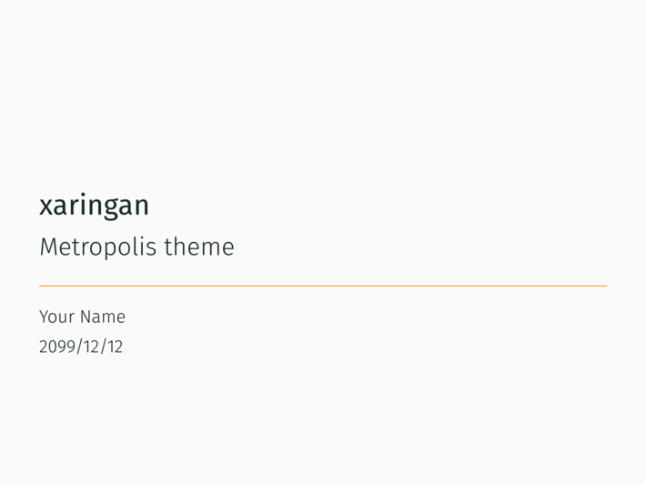
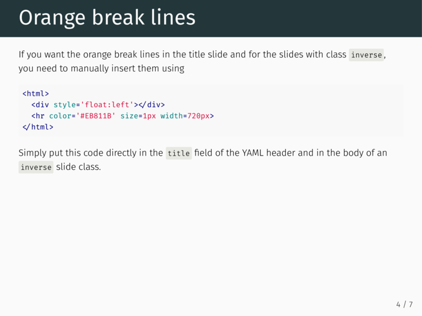

# xaringan

This is a theme for the R package [`xaringan`](https://github.com/yihui/xaringan) which itself relies on [`remark.js`](https://remarkjs.com/#1) to create a markdown based presentation. 
You can see an example of the default look of `xaringan` [here](http://slides.yihui.name/xaringan/).

## metropolis theme

The theme of this repository is trying to be a copy of the [`metropolis`](https://github.com/matze/mtheme) theme for the Beamer class in LaTeX. 
However, margins may not be correct and font sizes may not reflect the original theme. 
Currently, the theme only supports 4:3 ratio.
You can find the demo slides of the theme [here](https://pat-s.github.io/files/xaringan-metropolis.html#1).

Title slide                |  Content slide
:-------------------------:|:-------------------------:
  |  

## Installation

If you want to use this theme, you need to install `R` and the package `xaringan`

```r
remotes::install_github('yihui/xaringan')
```

If you use RStudio, it is easy to get started from the menu `File -> New File -> R Markdown -> From Template -> Ninja Presentation`, and you will see an R Markdown example. Press the `Knit` button to compile it, or use the RStudio Addin `Infinite Moon Reader` to live preview the slides (every time you update and save the Rmd document, the slides will be automatically reloaded; make sure the Rmd document is on focus when you click the addin). Please see the [issue #2](https://github.com/yihui/xaringan/issues/2) if you do not see the template or addin in RStudio.

Specify `metropolis` and `metropolis-fonts` in the `css` argument of `moon_reader()`

```yaml
output: 
  xaringan::moon_reader:
    css: [default, metropolis, metropolis-fonts]
```

## Additional tweaks

`remark.js` allows to have custom macros defined at startup that simplify your life with `xaringan`.
See this [xaringan demo slide](https://slides.yihui.name/xaringan/#30) for more information. 

## Further information

Feel free to fork and modify this theme.
Pull requests are also welcome.
Also have a look at the `xaringan` [wiki](https://github.com/yihui/xaringan/wiki) and `remark` [wiki](https://github.com/gnab/remark/wiki) to know all features of this presentation tool.

The main R Markdown output format in this package is `moon_reader()`. See the R help page `?xaringan::moon_reader` for all possible configurations.
